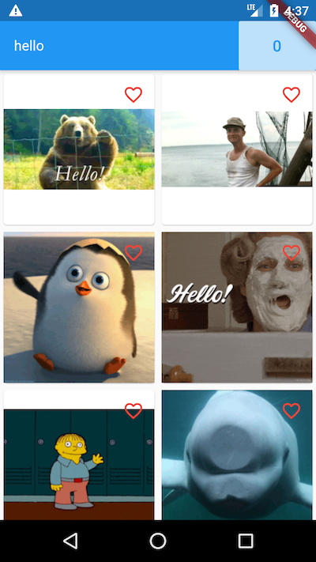

# Giphy Search

Giphy Search is an example Flutter project to search and display gifs from Giphy service.

## Screenshots

## Features
- searching gifs;
- lazy loading;
- marking as favorite;
- favorites screen.